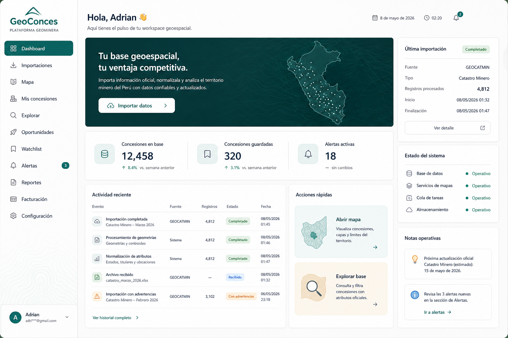

# GeoConces

SaaS para gestionar, explorar y monitorear concesiones mineras en Perú con información pública de INGEMMET, GEOCATMIN y SIDEMCAT.

> Estado: MVP funcional / pre-beta. El proyecto está en evolución y algunas integraciones dependen de servicios externos.

## Qué resuelve

GeoConces centraliza la búsqueda geográfica y documental de concesiones, permitiendo:

- Explorar concesiones sobre un mapa interactivo.
- Buscar por código, nombre, titular, región y otros filtros.
- Consultar el expediente y datos complementarios de SIDEMCAT.
- Guardar concesiones en listas de seguimiento.
- Visualizar alertas y resúmenes operativos.
- Importar datos en CSV, XLSX, GeoJSON o shapefile comprimido.
- Generar reportes y preparar búsquedas semánticas con embeddings.

## Stack

- Frontend: Next.js 14, TypeScript, Tailwind CSS, shadcn/ui, Leaflet, Zustand y TanStack Query.
- Backend: FastAPI, SQLAlchemy, Pydantic y Celery.
- Datos: PostgreSQL con PostGIS y pgvector.
- Infraestructura local: Docker Compose y Redis.

## Requisitos

- Docker y Docker Compose.
- Node.js 20+ si ejecutas el frontend fuera de Docker.
- Python 3.11+ si ejecutas el backend fuera de Docker.

## Inicio rápido

~~~bash
# Desde la raíz del repositorio
docker compose up --build db redis backend

# En otra terminal
cd frontend
npm install
npm run dev
~~~

Servicios:

- Frontend: http://localhost:3000
- API: http://localhost:8000
- Swagger: http://localhost:8000/docs
- PostgreSQL: localhost:5432
- Redis: localhost:6379

Para levantar el frontend dentro de Docker:

~~~bash
docker compose --profile fullstack up --build
~~~

Para cargar datos demo:

~~~bash
docker compose exec backend python scripts/seed.py
~~~

## Configuración y seguridad

1. Copia .env.example a .env y backend/.env.example a backend/.env cuando corresponda.
2. Genera un SECRET_KEY aleatorio de al menos 32 caracteres.
3. Mantén VERIFY_TLS=true en entornos reales.
4. No subas archivos .env, credenciales, tokens, media/, storage/ ni bases de datos locales.

El flujo de recuperación de contraseña usa tokens de un solo uso con expiración de 30 minutos. En desarrollo el token se devuelve para facilitar pruebas; en producción debe conectarse a un proveedor de correo antes de habilitar el flujo para usuarios finales.

## Base de datos y migraciones

Alembic es la fuente de verdad del esquema:

~~~bash
cd backend
alembic upgrade head
~~~

El backend ejecuta las migraciones durante el arranque de Docker. AUTO_CREATE_TABLES permanece desactivado por defecto.

## Importar concesiones

~~~bash
cd backend
python scripts/import_concessions.py /ruta/al/archivo.csv
python scripts/import_concessions.py /ruta/al/archivo.geojson --source geocatmin
python scripts/import_concessions.py /ruta/al/archivo.zip --source shapefile --import-type bulk_sync
~~~

También están disponibles los endpoints autenticados:

- POST /ingestion/concessions/upload
- GET /ingestion/logs

## Estructura

~~~text
GeoConces/
├── docker-compose.yml
├── .env.example
├── backend/
│   ├── app/
│   │   ├── auth/          # registro, login y JWT
│   │   ├── concessions/   # búsqueda y detalle
│   │   ├── maps/          # endpoints geográficos
│   │   ├── sidemcat/      # integración documental
│   │   ├── alerts/        # alertas y seguimiento
│   │   ├── core/          # configuración, DB y seguridad
│   │   └── models.py
│   ├── alembic/
│   ├── scripts/
│   └── requirements.txt
└── frontend/
    ├── app/
    ├── components/
    ├── lib/
    └── store/
~~~

## Validación local

~~~bash
cd frontend
npm run build

cd ../backend
alembic check
~~~

## Límites actuales

- La sincronización con fuentes externas depende de la disponibilidad y el formato de INGEMMET/SIDEMCAT.
- El envío de recuperación por email requiere configurar Resend.
- Pagos, notificaciones avanzadas y parte de la analítica comercial siguen en desarrollo.
- Antes de una puesta en producción conviene completar pruebas end-to-end, observabilidad y revisión de aislamiento multiempresa.

## Licencia

Código propietario. El repositorio público se mantiene para revisión y colaboración controlada; no se concede una licencia de uso, modificación o redistribución sin autorización expresa.
